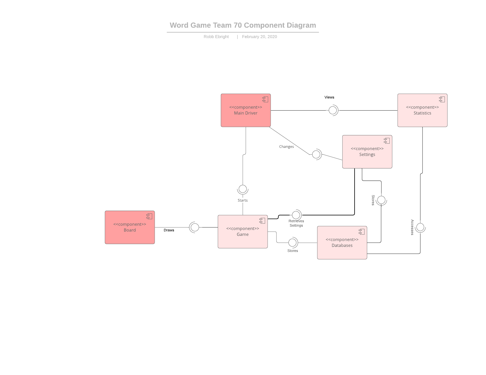
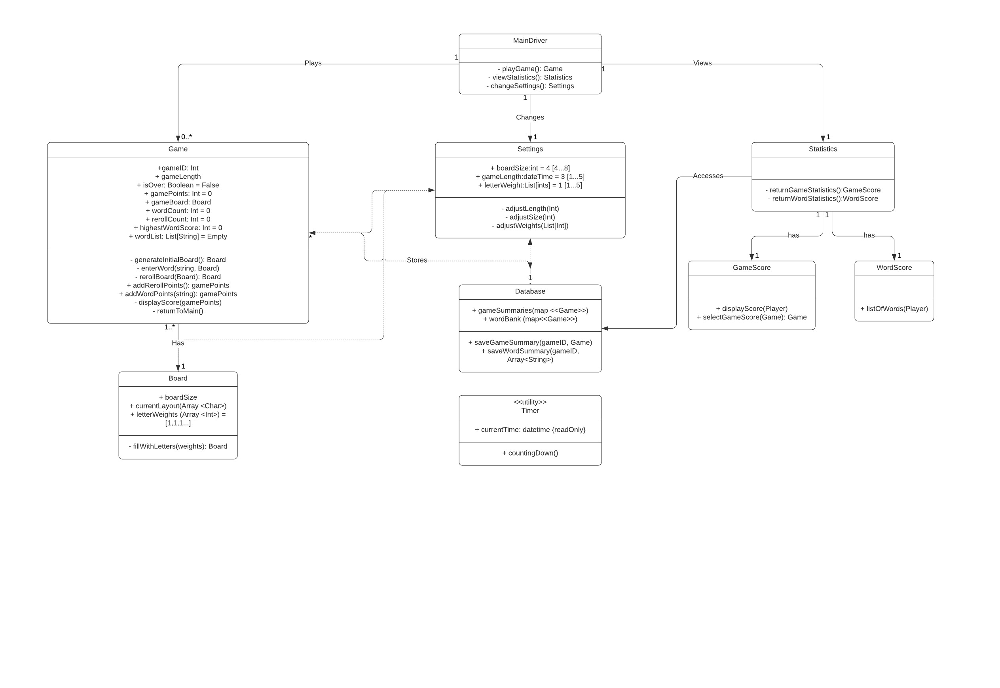
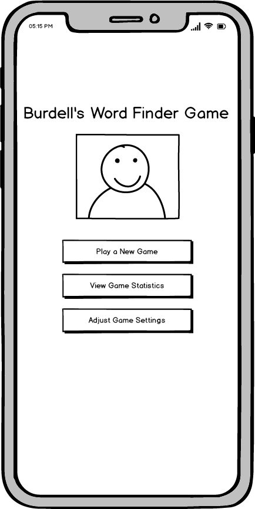
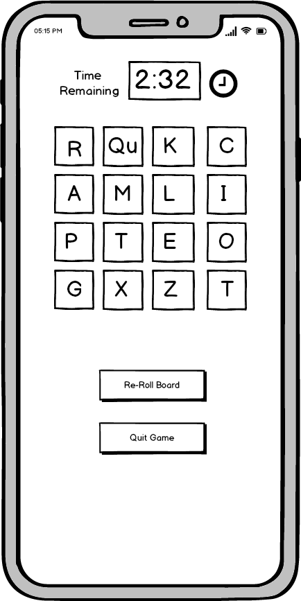
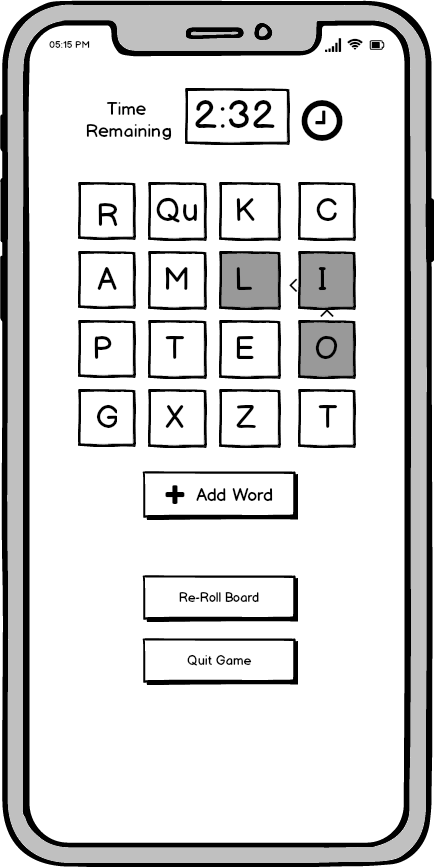
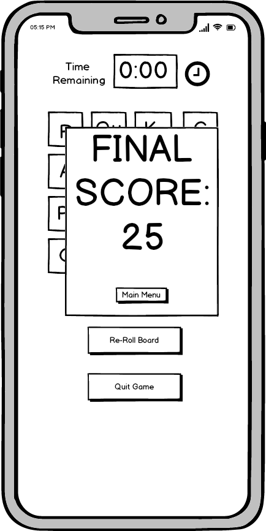
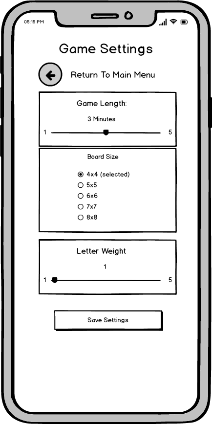
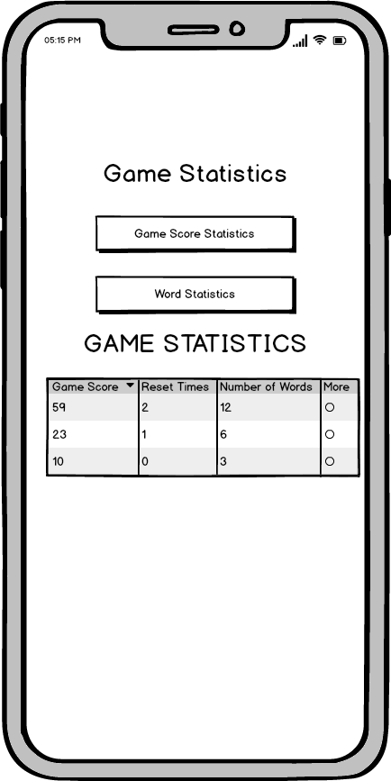
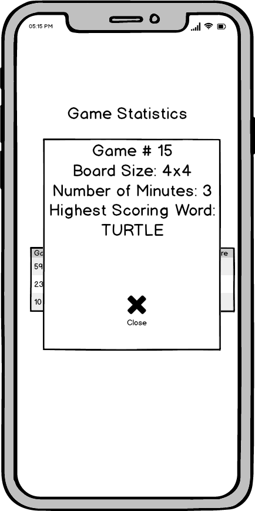
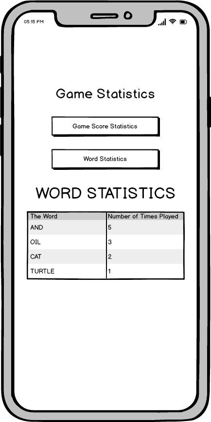

# Design Document

**Author**: Robb Ebright

## 1 Design Considerations

### 1.1 Assumptions

The primary assumption is that this software will be designed to work on devices running the Android operating system. It will be developed using Java as the primary coding language and Android studio as the primary IDE.
The software will depend primarily on libraries provided by the Android framework distributed by Google. It should not be necessary to use any 3rd party libraries to develop this application outside of the typical Android tool kit.
In addition the project will be developed in a short time-frame with development by a remote team with varying levels of time to commit to the project.
Because of the limited time frame of the project we will be focusing primarily on an off-line game that will not require Internet connectivity to operate after the initial download.
We will not be utilizing the Android play store to distribute this app and it will be installed locally on devices for testing purposes.

### 1.2 Constraints

Because Android devices typically don't have keyboards and mice as input devices, the system will need to be designed to utilize a touch based UI.
Because Android can encapsulate a number of different devices of varying screen size it will be important to have a UI that is useable on both smaller screens and larger screens and adjusts the layout accordingly and fluidly.
In addition, Android devices can have different orientations - portrait or landscape. This application will adjust the layout according to the orientation of the device.

### 1.3 System Environment

The Android operating system generally runs on battery-based devices such as mobile phones or tablets so it is important to understand the framework provided by Android to start activities and perform actions.
Android performs its own memory management and battery saving so it will be important for the application to save the state locally as the game is in progress.
Because SQLite is built into Android and API wrappers are provided this will be the choice for storing local data.

## 2 Architectural Design

### 2.1 Component Diagram

### 2.2 Deployment Diagram

Because this application will be deployed as a single android package to be installed directly on devices it isn't necessary to create a deployment diagram at this time.

## 3 Low-Level Design

### 3.1 Class Diagram

## 4 User Interface Design
Below are the initial wireframes (developed using Balsamiq) for UI/UX prototyping.
### Main Menu

### Game Board

### Word Selected

### Final Score Displayed

### Adjust Game Settings

### View Game Statistics

