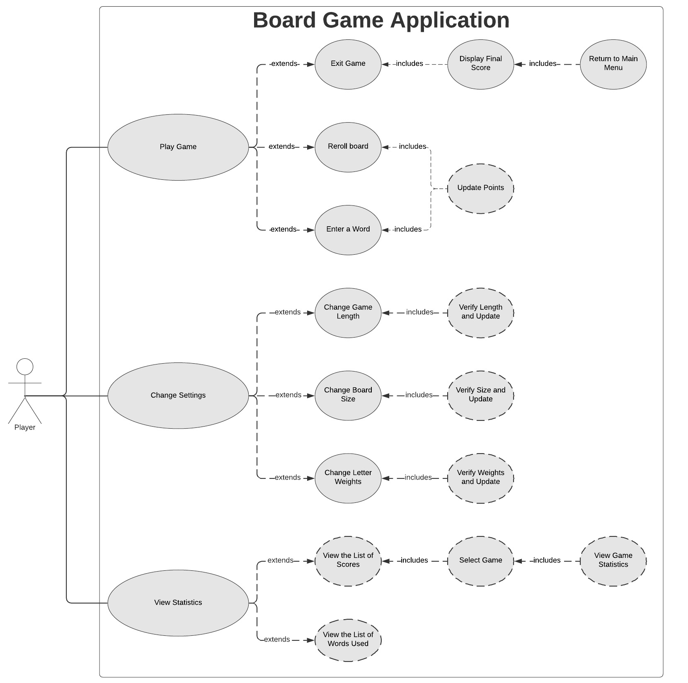

# Use Case Model

**Author:** Marc Micatka, Min Zhang\
**Last Updated:** 20-February-2020
## 1 Use Case Diagram

## 2 Use Case Descriptions
### Play Game Requirements
*1.1) User can select Play Game*\
**Pre-Condition**\
User has opened application\
Application is on main menu\
**Post-Condition**\
Application has opened the Play Game page\
**Scenario**\
User opens up the application\
User selects Play Game\
Application switches to show the Play Game view

*1.2) User is shown board game*\
**Pre-Condition**\
User has selected Play Game\
Game View is shown\
**Post-Condition**\
User is shown board game\
**Scenario**\
User opens the application\
User selects Play Game\
Application switches to Play Game view\
Application displays board and countdown timer\
Game points are 0

*1.3) User can enter words*\
**Pre-Condition**\
User has selected Play Game\
Game View is shown\
Game Timer is not 0\
**Post-Condition**\
Points are accumulated (not visibly)\
**Scenario**\
User opens the application\
User selects Play Game\
Application switches to Play Game view\
Application displays board and countdown timer\
User enters unique word of length>=2 using letters on board

*1.4) User can reroll board*\
**Pre-Condition**\
User has selected Play Game\
Game View is showing\
Board is already generated\
Game Timer is not 0\
**Post-Condition**\
Application displays new board with randomly generated letters\
Points are accumulated (not visibly)\
**Scenario**\
User opens the application\
User selects Play Game\
Application switches to Play Game view\
Application displays board and countdown timer\
User selects Reroll Board\
Application generates new board with randomly generated letters, displays board\
Points are accumulated (not visibly)

*1.5) User can leave game before time is out*\
**Pre-Condition**\
User has selected Play Game\
Game View is shown\
Game Timer is not 0\
**Post-Condition**\
Application displays final game score\
**Scenario**\
User opens the application\
User selects Play Game\
Application switches to Play Game view\
Application displays board and countdown timer\
Game points are 0\
User selects Exit Game\
Application displays final point total for game

*1.6) User views final score*
**Pre-Condition**\
User has selected Play Game\
Game Timer is 0 or User has selected Exit Game\
**Post-Condition**\
Application displays Final Score\
**Scenario**\
User opens the application\
User selects Play Game\
Application switches to Play Game view\
Application displays board and countdown timer\
Game Timer runs out or User selects Exit Game\
Application displays Final Score

*1.7) User continues to main menu after viewing final score*\
**Pre-Condition**\
User has selected Play Game\
Final Score is showing\
**Post-Condition**\
Application displays Main Menu\
**Scenario**\
User opens the application\
User selects Play Game\
Application switches to Play Game view\
Application displays board and countdown timer\
Game Timer runs out or User selects Exit Game\
Application displays Final Score\
User selects Continue to Main Menu\
Application displays Main Menu\

### View Statistics Requirements
*2.1) User can select View Statistics*\
**Pre-Condition**\
User has just opened application\
Application is on main menu\
**Post-Condition**\
Application has opened the View Statistics page\
**Scenario**\
User opens up the application\
User selects "View Statistics"\
Application switches to show the View Statistics page

 *2.2) User can view Game Score Statistics*\
**Pre-Condition**\
Application is on View Statistics page\
**Post-Condition**\
Application has opened the Game Score Statistics page\
**Scenario**\
User opens up the application\
User selects View Statistics\
Application switches to show the View Statistics page\
User selects Game Score Statistics\
Application switches to show Game Score Statistics\
Application displays table showing Final Game Score, Board Reset #, and Number of Words entered, sorted by final score

 *2.3) User can view individual Game Score Statistics*\
**Pre-Condition**\
Application is on View Statistics page\
**Post-Condition**\
Application has opened the Game Score Statistics page\
**Scenario**\
User opens up the application\
User selects View Statistics\
Application switches to show the View Statistics page\
User selects Game Score Statistics\
Application switches to show Game Score Statistics\
User selects Game from list of Game Scores\
Applications displays settings for Game - Board Size, Game Length, and highest scoring word

 *2.4) User can view word statistics*\
**Pre-Condition**\
Application is on View Statistics page\
**Post-Condition**\
Application has opened the view game statistics page\
**Scenarios**\
User opens up the application\
User selects "View Statistics"\
Application switches to show the View Statistics page\
User selects Word Statistics\
Application switches to show Word Statistics\
Application displays table showing list of words used and number of times word was played sorted by frequency

### Change Settings Requirements
*3.1) User can select Change Settings*\
**Pre-Condition**\
User has opened application\
Application is on main menu\
**Post-Condition**\
Application has opened the Change Settings page\
**Scenario**\
User opens up the application\
User selects "Change Settings"\
Application switches to show the  Change Settings page

*3.2) User can change Game Length*
**Pre-Condition**\
Application is on Change Settings page\
**Post-Condition**\
Game Length attribute has been adjusted\
Application is on Change Settings page\
**Scenario**\
User opens up the application\
User selects "Change Settings"\
Application switches to show the Change Settings page\
User selects new value for Game Length, submits choice\
Application stays on Change Settings page

*3.3) User can change Board Size*\
**Pre-Condition**\
Application is on Change Settings page\
**Post-Condition**\
Board Size attribute has been adjusted\
Application is on Change Settings page\
**Scenario**\
User opens up the application\
User selects "Change Settings"\
Application switches to show the Change Settings page\
User selects new value for Board Size, submits choice\
Application stays on Change Settings page

*3.4) User can change Letter Weights*\
**Pre-Condition**\
Application is on Change Settings page\
**Post-Condition**\
Letter Weights attribute has been adjusted\
Application is on Change Settings page\
**Scenario**\
User opens up the application\
User selects "Change Settings"\
Application switches to show the Change Settings page\
User selects new values for Letter Weights, submits choice\
Application stays on Change Settings page
