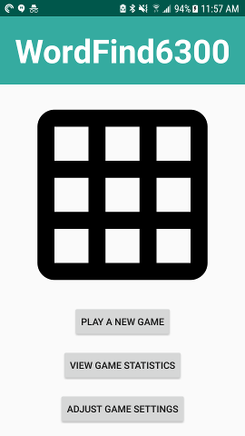
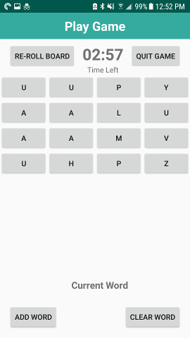
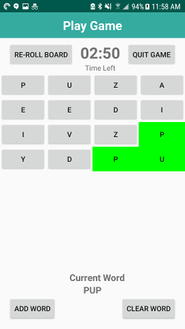
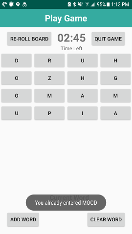
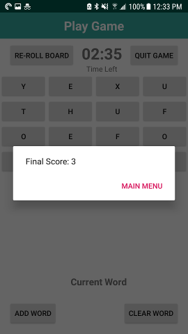
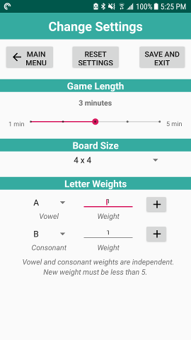
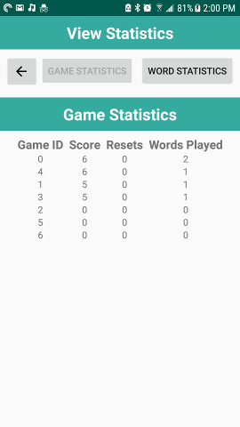
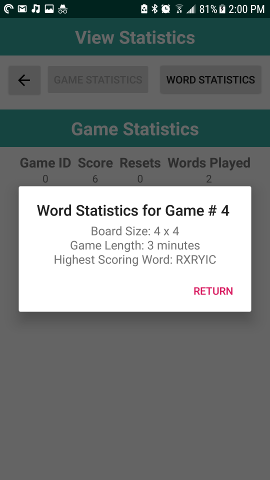
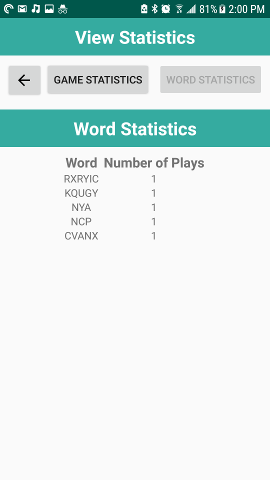

# WordFind6300 User Manual
**Author:** Marc Micatka\
**Last Updated:** March 2, 2020 (version 2)
## Overview
This manual documents the installation and use of the WordFind6300 application.
The APK for this installation is located in the main directory in folder "APK".

## Installation
Install application using Android Studio 3.6 or newer.

## Use Instructions
Upon opening the app, you'll see the main screen
### Main Screen

You can play a new game, change settings, or view your game statistics.
If you choose to play a new game, you'll see the play game screen.
### Game Play
To play a game, select "PLAY A NEW GAME" from the main screen.

Words can be entered by touching the a letter. After you select a letter, you can only select letters that are adjacent to the last letter and you cannot re-select the same letter. 

If you want to clear your current selection, click the "CLEAR WORD" button in the bottom right. 
If you want to enter your current selection, click the "ADD WORD" button in the bottom left.

After clearing or adding a word, the board is reset back to a blank board.Although you are allowed to select the same word twice - it will not increase your score and you'll see a popup message.\

If you want a new randomly generated board, click "REROLL BOARD". This will deduct 5 points from your game point total. The game is over either when the timer runs out or when the user selects, "QUIT GAME". When that happens, a dialog will show your final score and allow you to return to the main screen.\

### Changing Settings
To change the game settings, return to the main menu and select "VIEW GAME SETTINGS".\

The user is allowed to change the game length, board size, and letter weights.
  1. Game length can be changed from 1 to 5 minutes, defaulting to 3 minutes.
  2. Board size can be changed from 4x4 grid up to an 8x8 grid.
  3. Letter weights can be changed from 1 to 5. Consonant and vowel weights are calculated independently and vowel to consonant ratios are fixed. Click the "+" symbol to update the letter weights.
To save your settings, click "SAVE AND EXIT" to return to the Main Screen. 
To return without saving, click "MAIN MENU".
To reset your settings to the default values (board size is 4x4, game length is 3 minutes, and letters weights all equal to 1), click "Reset Settings". This will save the new settings as well.

### View Statistics
To view the game statistics, return to the main menu and select "VIEW GAME STATISTICS".
The default view is word statistics.

Click on any Game ID to get more details about the settings for that game.

Click on "WORD STATISTICS" to view word statistics.

